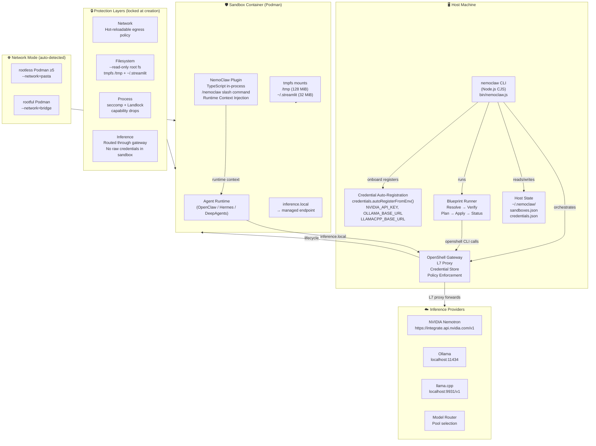
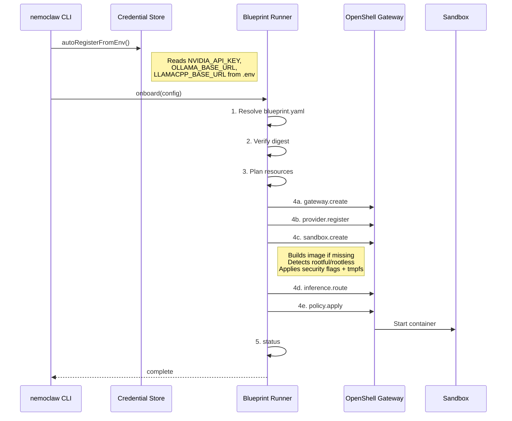
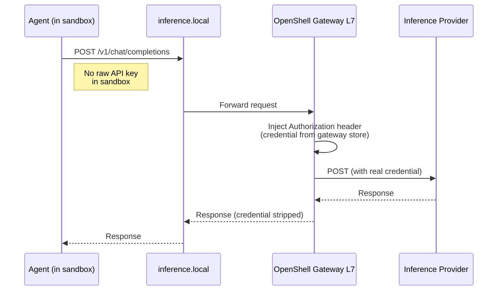
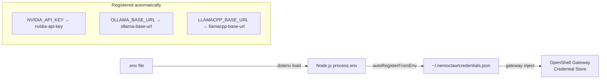

# NemoClaw Architecture

## System Architecture



## Component Descriptions

| Component | Language | Location | Purpose |
|-----------|----------|----------|---------|
| **nemoclaw CLI** | JavaScript (CJS) | `bin/` | Host-side orchestration, user interface |
| **lib modules** | JavaScript (CJS) | `bin/lib/` | Onboard, inference, policies, runner, state, credentials |
| **NemoClaw Plugin** | TypeScript (ESM) | `nemoclaw/src/` | In-sandbox plugin: inference provider, slash commands, context |
| **Blueprint** | YAML | `nemoclaw-blueprint/` | Sandbox definition, policies, inference profiles |
| **Dashboard** | Python/Streamlit | `dashboard/` | Web UI for sandbox management (port 8501) |
| **Scripts** | Bash | `scripts/` | Automation: start, stop, dev-setup, podman-build, podman-clean |

## Blueprint Lifecycle



## Inference Flow



## Container Security Flags

Every sandbox container launched by `runner.js` (`createSandbox`) carries the following hardened flags:

| Flag | Purpose |
|------|---------|
| `--read-only` | Immutable root filesystem — prevents agent from modifying system files |
| `--security-opt no-new-privileges` | Blocks `setuid`/`setgid` privilege escalation |
| `--cap-drop=all` | Drops all Linux capabilities |
| `--tmpfs /tmp:rw,noexec,nosuid,size=128m` | Writable temp space; `noexec` prevents script execution |
| `--tmpfs /home/nemoclaw/.streamlit:rw,nosuid,size=32m` | Allows Streamlit session writes without breaking `--read-only` |
| `--network=bridge` or `--network=pasta` | Auto-detected (see below) |

## Podman Network Mode Auto-Detection

`runner.js` inspects the Podman runtime at startup:

```
podman info --format {{.Host.Security.Rootless}}
```

| Mode | Detection | Network flag |
|------|-----------|-------------|
| **Rootless** Podman ≥ 5 | `Rootless=true` + version ≥ 5 | `--network=pasta` |
| **Rootless** Podman < 5 | `Rootless=true` + version < 5 | `--network=slirp4netns` |
| **Rootful** Podman | `Rootless=false` | `--network=bridge` |
| Docker (fallback) | `podman` not on PATH | `--network=bridge` |

> **Note:** Podman 6.x dropped `slirp4netns` entirely. The Podman machine on macOS with Podman Desktop typically runs rootful (`--network=bridge`).

## Credential Auto-Registration

During `nemoclaw onboard`, credentials are automatically registered from environment variables:



- Credential **values** are never written to disk (`credentials.json` stores names only)
- The gateway is the only component that holds the actual values in memory
- The dashboard Credentials page shows `.env` status vs. registered status and offers a "Register from .env" button

## Security Layers

| Layer | Applies when | Hot-reloadable |
|-------|-------------|----------------|
| **Network** | Runtime | ✅ Yes |
| **Filesystem** | Sandbox creation | ❌ No |
| **Process** | Sandbox creation | ❌ No |
| **Inference** | Runtime | ✅ Yes |

## Host State Layout

```
~/.nemoclaw/
├── sandboxes.json          # Registered sandbox metadata
├── credentials.json        # Credential names (no values stored)
├── policies/
│   └── <sandbox-name>/
│       └── policy.yaml     # Custom network policy
└── gateways/
    └── <port>/             # Per-gateway state (non-default ports)
```

## tmpfs Mount Rationale

The sandbox image is launched with `--read-only` to prevent the agent from modifying the root filesystem. However, some runtime components need writable space:

| tmpfs path | Size | Reason |
|-----------|------|--------|
| `/tmp` | 128 MiB | General agent scratch space; `noexec` prevents script execution |
| `/home/nemoclaw/.streamlit` | 32 MiB | Streamlit writes session cache + machine-ID here; baking `config.toml` with `gatherUsageStats = false` disables telemetry, but the directory still needs to be writable |

The `config.toml` is baked into the image at build time (multi-stage `Containerfile`) so the `--read-only` container starts cleanly without a network roundtrip to gather telemetry.
