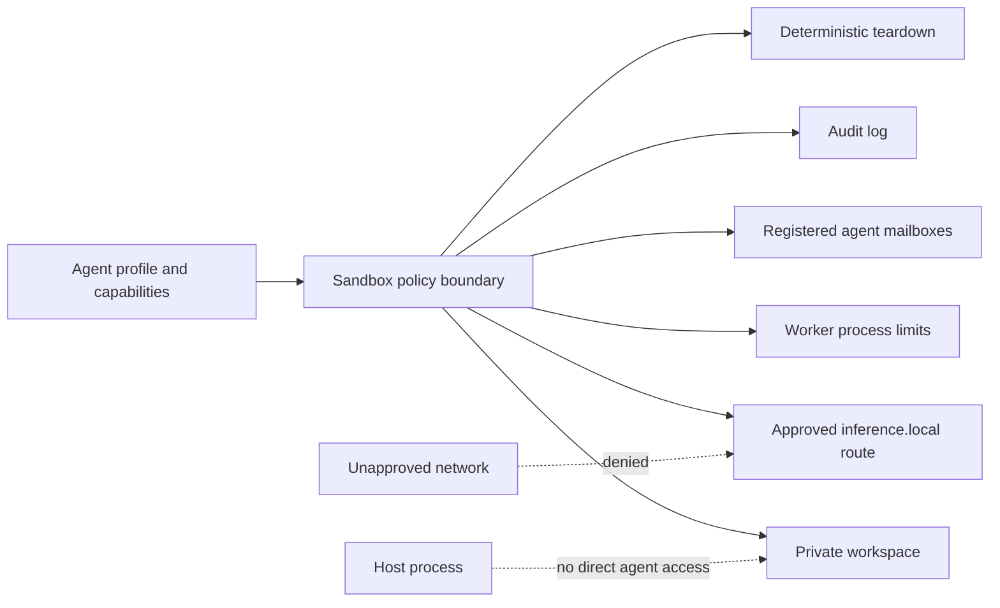

# NemoClaw Sandbox Demonstration — User Guide

## Table of contents

1. [Introduction](#introduction)
2. [Prerequisites and installation](#prerequisites-and-installation)
3. [Architecture overview](#architecture-overview)
4. [Run the demonstration](#run-the-demonstration)
5. [Test-case walkthrough](#test-case-walkthrough)
6. [Configure sandbox parameters](#configure-sandbox-parameters)
7. [Interpret results and logs](#interpret-results-and-logs)
8. [Common errors and resolution](#common-errors-and-resolution)
9. [Production best practices](#production-best-practices)
10. [Glossary](#glossary)

## Introduction

NemoClaw is NVIDIA's reference stack for running supported AI agents more safely in OpenShell sandboxes. The production stack combines a hardened container, filesystem and process controls, network policy, managed inference, and lifecycle operations. This repository also contains a dependency-free local demonstration so a technical team can validate the policy contract without requiring Podman, a cloud model, or external network access.

This guide demonstrates the following boundaries:

- **Filesystem:** agents can read and write under a private workspace only.
- **Network:** only the explicitly approved `inference.local` host is reachable through the modeled gateway.
- **Capabilities:** every operation is authorized against the agent profile.
- **Resources:** memory, CPU, and wall-clock limits are applied to worker processes.
- **Communication:** agents exchange messages only through registered in-sandbox mailboxes.
- **Lifecycle:** teardown removes the private workspace even after a denied operation.

The local harness is a test double for the enforcement contract; it does not replace OpenShell isolation for production workloads.

## Prerequisites and installation

### Required software

- Python 3.12 or newer.
- The repository checkout.
- No third-party Python package is needed for the sandbox demonstration.

The broader NemoClaw project additionally supports Node.js 22.16+, npm 10+, and Podman or Docker for the real containerized stack. See [`Docs/Quickstart.md`](Quickstart.md) for that full setup.

### Install the project environment

From the repository root:

```bash
python3 -m venv .venv
source .venv/bin/activate
python -m pip install -r requirements.txt
```

The demonstration itself uses only the Python standard library. Installing `requirements.txt` is recommended when running the complete project test suite.

## Architecture overview



The reference implementation has two layers:

1. **Production NemoClaw/OpenShell:** `nemoclaw-blueprint/blueprint.yaml` describes the sandbox image, security settings, resource requests, and network policy. [`bin/lib/runner.js`](../bin/lib/runner.js) launches the runtime with read-only and capability restrictions when a container runtime is available.
2. **Local demonstration:** [`scripts/nemoclaw_sandbox_demo.py`](../scripts/nemoclaw_sandbox_demo.py) models the same policy concepts with a private temporary directory, capability checks, an approved-host allowlist, child-process limits, in-memory mailboxes, audit events, and teardown.

The demo intentionally does not pass cloud credentials to the agent. In a production deployment, inference credentials should remain gateway-owned and be injected at the managed egress boundary.

## Run the demonstration

Run the end-to-end report:

```bash
python scripts/nemoclaw_sandbox_demo.py --json
```

Run the five executable test cases:

```bash
python -m unittest test/test_nemoclaw_sandbox.py -v
```

Run the existing Python tests as well:

```bash
python -m pytest test -v
```

## Test-case walkthrough

All scenarios use an `analyst` agent with workspace, inference, compute, and send-message capabilities. A second `reviewer` agent is registered only for the communication test.

### TC-01 — Normal in-sandbox execution

- **Setup:** Create a sandbox and register the analyst.
- **Execution:** Write `approved` to `workspace/report.txt`, then read it.
- **Expected result:** Both operations are permitted and the read returns `approved`.
- **Assertions:** `written.permitted` is true, the value is preserved, and the sandbox tears down.

Test method: `test_normal_in_sandbox_execution`.

### TC-02 — Escape and egress boundary violation

- **Setup:** Create a sandbox with the default `inference.local` allowlist.
- **Execution:** Request `../../etc/passwd` and then request `example.com`.
- **Expected result:** Both requests are denied.
- **Assertions:** Errors identify filesystem traversal and network-host denial respectively; audit events are recorded.

Test method: `test_escape_and_network_boundary_are_denied`.

### TC-03 — Resource enforcement

- **Setup:** Configure an 8 MiB memory limit and a 0.1-second timeout.
- **Execution:** Request 16 MiB and run an intentional infinite loop.
- **Expected result:** The memory request is rejected before allocation; the loop worker is terminated at the deadline.
- **Assertions:** The first error identifies the configured memory limit and the second identifies the timeout.

Test method: `test_resource_limits_are_enforced`.

### TC-04 — Inter-agent communication

- **Setup:** Register sender and receiver agents in one sandbox.
- **Execution:** Sender posts `approved` to the receiver mailbox; receiver reads it.
- **Expected result:** The message is delivered without a host or network channel.
- **Assertions:** Send is permitted and receiver gets the exact message.

Test method: `test_inter_agent_communication_stays_inside_sandbox`.

### TC-05 — Failure handling and teardown

- **Setup:** Start a sandbox and register the analyst.
- **Execution:** Request an unsupported operation, then call teardown.
- **Expected result:** A structured denial is returned; teardown removes the temporary workspace and closes the sandbox.
- **Assertions:** Error text identifies the unsupported operation, the root path no longer exists, and future root access raises `RuntimeError`.

Test method: `test_failure_is_reported_and_teardown_is_graceful`.

## Configure sandbox parameters

The local API accepts [`SandboxLimits`](../scripts/nemoclaw_sandbox_demo.py) values:

```python
from nemoclaw_sandbox_demo import Sandbox, SandboxLimits

limits = SandboxLimits(
    memory_limit_mb=128,
    timeout_seconds=2.0,
    cpu_limit_seconds=2,
    allowed_network_hosts=("inference.local", "api.internal.example"),
)
with Sandbox(limits) as sandbox:
    # Register an AgentProfile and call sandbox.run(...).
    pass
```

Use the smallest limits that support the workload. Adding a host to `allowed_network_hosts` is an explicit policy change and should be reviewed like firewall configuration.

For the production blueprint, review the `components.sandbox.security`, `components.sandbox.resources`, and `components.policy` sections in [`nemoclaw-blueprint/blueprint.yaml`](../nemoclaw-blueprint/blueprint.yaml). Container-level flags and network-mode behavior are documented in [`Docs/Architecture.md`](Architecture.md) and [`Docs/Security.md`](Security.md).

## Interpret results and logs

Each result contains:

- `operation`: requested action.
- `permitted`: whether policy allowed it.
- `value`: successful operation output.
- `error`: denial or worker failure explanation.

The `audit_events` count confirms that lifecycle, registration, and operation events were recorded. A successful run ends with `sandbox_torn_down: true`. Treat a permitted operation that should have been denied as a test failure and investigate the policy before adding more capabilities.

Production operators can use the existing CLI commands:

```bash
nemoclaw status
nemoclaw logs --lines 100
nemoclaw doctor
nemoclaw policy list
```

Never log API keys, bearer tokens, or unredacted agent secrets. The existing runner masks NVIDIA keys in command and error output.

## Common errors and resolution

| Symptom | Cause | Resolution |
|---|---|---|
| `sandbox is not active` | Work was attempted before `__enter__` or after teardown. | Use `with Sandbox(...)` and do not retain sandbox paths after the block. |
| `filesystem path denied` | Requested path escapes the private root. | Use a relative path under `workspace/`; do not weaken traversal checks. |
| `network host denied` | Host is not on the egress allowlist. | Route inference through the managed endpoint or review an explicit policy addition. |
| `capability denied` | Agent profile does not include the required capability. | Grant only the minimum capability needed, then add a regression test. |
| `operation exceeded ... timeout` | Work exceeded wall-clock deadline. | Optimize the operation or increase the limit only with workload evidence. |
| `No container runtime found` during real onboarding | Podman/Docker is absent or not on `PATH`. | Install and start Podman, then rerun host readiness checks. |
| Cloud inference fails | Provider credentials or route are not configured. | Use a local provider for offline tests or register credentials through the gateway; never embed them in the sandbox image. |

## Production best practices

1. Treat agent capabilities as an allowlist; start with no capabilities and add narrowly scoped permissions.
2. Keep the sandbox root read-only where possible and expose only purpose-built writable volumes.
3. Default network egress to deny and approve exact host, port, and protocol combinations.
4. Keep provider credentials in a gateway or secret manager; never put them in prompts, images, logs, or workspace files.
5. Apply CPU, memory, process-count, and wall-clock quotas appropriate to the task.
6. Use immutable, digest-pinned images and verify blueprint or image integrity before launch.
7. Emit structured audit events for policy decisions, agent identity, and lifecycle transitions.
8. Test both allowed and denied paths in CI; a sandbox is not validated by happy-path tests alone.
9. Destroy temporary sandboxes after every test and remove sensitive artifacts from persistent volumes.
10. Keep host, container runtime, OpenShell, and NemoClaw components patched and run diagnostics regularly.

## Glossary

| Term | Definition |
|---|---|
| **Agent profile** | Identity, role, and explicit capabilities assigned to an agent. |
| **Capability** | Named permission required for an operation such as workspace writing or inference. |
| **Egress** | Traffic leaving the sandbox toward another host or service. |
| **Gateway** | Managed boundary that routes inference and can hold provider credentials outside the sandbox. |
| **Landlock** | Linux filesystem access-control mechanism used by hardened sandbox implementations. |
| **NemoClaw** | NVIDIA reference stack for safer execution of supported AI agents in OpenShell sandboxes. |
| **OpenShell** | Sandbox and lifecycle environment used by the NemoClaw reference stack. |
| **Policy boundary** | The combined authorization, filesystem, network, and resource controls around an agent. |
| **Resource limit** | Maximum memory, CPU, process, or execution time available to a workload. |
| **Sandbox teardown** | Closing the execution context and removing temporary state and resources. |
| **Seccomp** | Linux system-call filtering mechanism used to reduce process privileges. |
| **tmpfs** | In-memory filesystem commonly used for narrowly scoped temporary writes. |

## License

This demonstration follows the repository's Apache License 2.0 terms.
