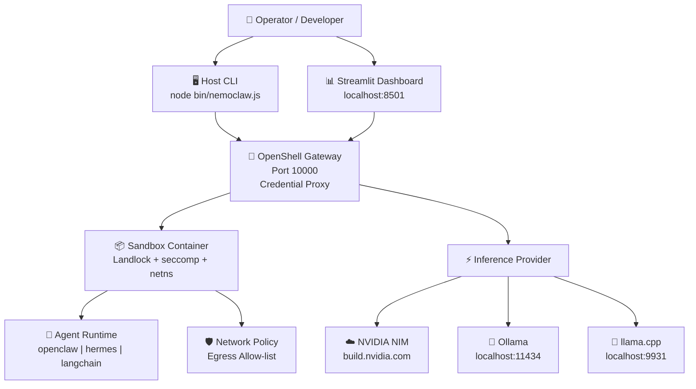

# NemoClaw — User Story & Feature Specification

<!-- SPDX-FileCopyrightText: Copyright (c) 2026 NVIDIA CORPORATION & AFFILIATES. All rights reserved. -->
<!-- SPDX-License-Identifier: Apache-2.0 -->

---

## Epic: Sandboxed AI Agent Orchestration with NVIDIA NemoClaw

---

### User Story 1 — Core Platform Identity

**Title:** Run sandboxed AI agents securely on any local or cloud machine

> As a **platform engineer or AI developer**,
> I need **a single, self-contained CLI + dashboard stack that provisions, manages, and monitors sandboxed AI agent runtimes**,
> So that **I can run NVIDIA NemoClaw agents in an isolated, policy-controlled environment without exposing API keys, credentials, or host-system resources to the agent process itself.**

**Acceptance Criteria:**
1. The CLI binary (`node bin/nemoclaw.js`) is the single host-side entry point for all sandbox lifecycle operations.
2. All secrets (NVIDIA API key, inference credentials) are stored on the host and proxied through the OpenShell gateway — never injected directly into the sandbox.
3. The application runs fully locally with no mandatory cloud dependency when Ollama or llama.cpp is configured as the inference provider.
4. A Streamlit dashboard at `http://localhost:8501` provides a visual management interface alongside the CLI.
5. All 75 tests (35 CLI, 26 TypeScript plugin, 14 Python) pass from a clean install.

---

### User Story 2 — Host Readiness & Health Checking

**Title:** Verify the host environment before provisioning any sandbox

> As a **developer setting up NemoClaw for the first time**,
> I need **a pre-flight readiness probe and a health-check doctor command**,
> So that **I can confirm my API key, container runtime (Podman/Docker), and network policy are all valid before committing to a full sandbox onboard.**

**Acceptance Criteria:**
1. `nemoclaw host probe` runs a read-only scan of the host environment and reports pass/fail for each dependency (Node ≥22, container runtime, `.env` variables, inference endpoint reachability).
2. `nemoclaw host probe --json` emits structured JSON output suitable for CI pipelines.
3. `nemoclaw doctor` checks a running sandbox's health post-onboard and surfaces degraded components.
4. Both commands exit with a non-zero code on failure so scripts can react automatically.
5. No sandbox is created or modified during either command.

---

### User Story 3 — Sandbox Lifecycle Management

**Title:** Provision, operate, and tear down AI agent sandboxes with simple commands

> As an **AI platform operator**,
> I need **a complete set of lifecycle commands (onboard → start → stop → rebuild → destroy)**,
> So that **I can reliably manage sandbox state across restarts, upgrades, and incident recovery without manual container operations.**

**Acceptance Criteria:**
1. `nemoclaw onboard` completes the full 5-step blueprint lifecycle: Resolve → Verify → Plan → Apply → Status.
2. Options `--agent`, `--name`, `--provider`, `--model`, `--resume`, `--fresh`, and `--from <blueprint>` are all respected.
3. `nemoclaw list` displays all registered sandboxes in a formatted table with their status, agent runtime, and inference provider.
4. `nemoclaw use <sandbox>` sets the active default sandbox for all subsequent commands.
5. `nemoclaw start` / `nemoclaw stop` control a running sandbox gracefully without data loss.
6. `nemoclaw rebuild` recreates the sandbox from its recorded configuration without re-onboarding.
7. `nemoclaw destroy --yes` removes the sandbox and its registration; `--keep-data` preserves data volumes.
8. `nemoclaw recover` repairs a stopped or degraded agent runtime.

---

### User Story 4 — Inference Provider Integration

**Title:** Switch between NVIDIA NIM, Ollama, and llama.cpp without re-provisioning

> As a **developer who wants to control inference costs and latency**,
> I need **to configure and hot-swap inference providers (NVIDIA cloud, Ollama local, llama.cpp local) per sandbox**,
> So that **I can use the NVIDIA API during production-grade testing and a local model for offline or cost-sensitive development.**

**Acceptance Criteria:**
1. `NEMOCLAW_INFERENCE_PROVIDER` in `.env` accepts `nvidia`, `ollama`, `openai-compatible`, and `model-router`.
2. `NVIDIA_API_KEY` (obtained from [build.nvidia.com](https://build.nvidia.com)) is only required when provider is `nvidia`.
3. Ollama runs at `http://localhost:11434` and llama.cpp at `http://localhost:9931/v1` by default — both zero-configuration.
4. `nemoclaw inference get` prints the current provider, base URL, and model for the active sandbox.
5. `nemoclaw inference set --provider ollama --model llama3` switches provider without destroying the sandbox.
6. API keys are never written into the sandbox container — they are proxied through the OpenShell gateway.

---

### User Story 5 — Network Egress Policy Control

**Title:** Enforce fine-grained outbound network access for agent workloads

> As a **security engineer**,
> I need **to define, inspect, and modify egress allow-lists for each sandbox**,
> So that **I can guarantee that a compromised or misbehaving agent cannot exfiltrate data or reach unintended external endpoints.**

**Acceptance Criteria:**
1. `nemoclaw policy list` shows all active egress rules for the target sandbox.
2. `nemoclaw policy add <host[:port][/protocol]>` adds a new allow-list rule.
3. `nemoclaw policy remove <rule>` removes a rule without restarting the sandbox.
4. `nemoclaw policy explain <rule>` gives a plain-English description of what the rule permits.
5. Network presets for `slack` and `discord` are available in `nemoclaw-blueprint/policies/presets/`.
6. SSRF validation (strict mode by default) blocks private-network addresses from being used as egress targets.
7. `nemoclaw shields up/down` toggles the full security posture; `shields down` requires explicit `--yes` confirmation.

---

### User Story 6 — Credentials & Secret Management

**Title:** Store and rotate provider credentials without exposing them to the agent

> As an **operator managing multiple API integrations**,
> I need **a credential store backed by the OpenShell gateway that holds secrets by name, not value**,
> So that **agents can use credentials by reference while the actual keys remain on the host and are never visible inside the sandbox.**

**Acceptance Criteria:**
1. `nemoclaw credentials list` prints credential names only — no values are ever displayed.
2. `nemoclaw credentials add <name> --provider <provider>` prompts for the secret value interactively (not as a CLI flag).
3. `nemoclaw credentials reset <name>` rotates a credential without disrupting a running sandbox.
4. Credentials are stored in `~/.nemoclaw` (configurable via `NEMOCLAW_STATE_DIR`).

---

### User Story 7 — Observability & Debugging

**Title:** Inspect sandbox state, logs, and MCP server integrations at any time

> As a **developer debugging an agent run**,
> I need **real-time log tailing, structured status output, and MCP server management from the CLI**,
> So that **I can diagnose issues without shelling into the container directly.**

**Acceptance Criteria:**
1. `nemoclaw status --json` emits a machine-readable snapshot of sandbox state, inference config, and shield posture.
2. `nemoclaw logs --follow --lines 100` streams live output from the sandbox to the terminal.
3. `nemoclaw exec <command>` runs an arbitrary command inside the sandbox with output piped back to the host.
4. `nemoclaw mcp list/add/status/restart/remove` manages Model Context Protocol server integrations per sandbox.
5. `nemoclaw snapshot create/list/restore` enables point-in-time capture and rollback of sandbox state.
6. `LOG_LEVEL=debug` in `.env` or `--debug` on any command enables verbose logging to stdout or to `LOG_FILE`.

---

### User Story 8 — Dashboard UI

**Title:** Monitor and manage sandboxes through a visual web interface

> As a **developer or team lead who prefers a GUI over the CLI**,
> I need **a Streamlit dashboard that provides real-time visibility into sandbox state, inference config, and policies**,
> So that **I can share a live status view with teammates without granting them CLI access.**

**Acceptance Criteria:**
1. `./scripts/start.sh` launches the dashboard in detached mode and prints `http://localhost:8501` to the console.
2. `./scripts/stop.sh` shuts down the dashboard gracefully.
3. Port 8501 is used (port 5000 is reserved on macOS for AirDrop and is never used).
4. The dashboard reads sandbox state from `~/.nemoclaw` and the active `.env` — no separate config required.
5. Dashboard source is in `dashboard/app.py`; all 14 Python unit tests pass via `pytest test/test_dashboard.py`.

---

### User Story 9 — Developer Experience & CI Readiness

**Title:** Set up and validate the full NemoClaw stack in under 5 minutes

> As a **new contributor or CI pipeline**,
> I need **a reproducible, one-command setup that installs dependencies, runs all tests, and confirms the stack is healthy**,
> So that **I can contribute code or gate pull requests with confidence that nothing is broken.**

**Acceptance Criteria:**
1. `npm install && cd nemoclaw && npm install && cd ..` installs all Node.js dependencies.
2. `python3 -m venv venv && source venv/bin/activate && pip install -r requirements.txt` creates an isolated Python environment.
3. `cp .env.example .env` followed by filling in `NVIDIA_API_KEY` is the only required configuration step for cloud inference.
4. `npm test` runs 35 CLI tests — all pass with zero `--project` flag issues.
5. `npm run test:plugin` runs 26 TypeScript plugin tests — all pass.
6. `pytest test/test_dashboard.py` runs 14 Python tests — all pass.
7. **Total: 75/75 tests green from a clean environment.**
8. `nemoclaw completion zsh` / `bash` / `fish` generates shell auto-completion scripts.
9. `nemoclaw resources` prints links to documentation, GitHub, Discord, and the security policy.

---

## Implementation Summary

### Architecture Overview

### Implemented Feature Matrix

| Layer | Technology | Entry Point | Tests |
|---|---|---|---|
| **Host CLI** | Node.js 22 CJS | `bin/nemoclaw.js` | 35 (Vitest) |
| **TypeScript Plugin** | TypeScript ESM | `nemoclaw/src/index.ts` | 26 (Vitest) |
| **Dashboard UI** | Python / Streamlit | `dashboard/app.py` | 14 (pytest) |
| **Blueprint** | YAML | `nemoclaw-blueprint/blueprint.yaml` | — |
| **Network Policies** | YAML | `nemoclaw-blueprint/policies/` | — |
| **Container Image** | Dockerfile/Containerfile | `Dockerfile` | — |
| **Automation Scripts** | Bash | `scripts/` | — |
| **Documentation** | Markdown | `Docs/` | — |

### CLI Command Reference Summary

| Command | Description |
|---|---|
| `host probe [--json]` | Read-only host readiness check |
| `doctor` | Post-onboard sandbox health check |
| `onboard` | Full 5-step blueprint lifecycle |
| `list` | Show all registered sandboxes |
| `use <sandbox>` | Set active default sandbox |
| `status [--json]` | Sandbox + inference status |
| `start / stop` | Sandbox power control |
| `logs [--follow]` | Stream sandbox logs |
| `exec <cmd>` | Run command inside sandbox |
| `rebuild` | Recreate from recorded config |
| `destroy` | Remove sandbox + registration |
| `recover` | Repair degraded runtime |
| `inference get/set` | Manage inference provider |
| `policy list/add/remove/explain` | Manage egress allow-list |
| `credentials list/add/reset` | Manage credential store |
| `shields status/up/down` | Security posture control |
| `mcp list/add/status/restart/remove` | MCP server integrations |
| `snapshot create/list/restore` | Point-in-time sandbox snapshots |
| `completion [shell]` | Shell auto-completion |
| `resources` | Docs, GitHub, Discord links |
| `gc [--dry-run]` | Garbage-collect stale state |

### Test Suite Summary

| Suite | Runner | File | Count | Status |
|---|---|---|---|---|
| CLI integration | Vitest | `test/cli.test.js` | 35 | ✅ PASS |
| TypeScript plugin | Vitest | `nemoclaw/src/**/*.test.ts` | 26 | ✅ PASS |
| Python dashboard | pytest | `test/test_dashboard.py` | 14 | ✅ PASS |
| **Total** | | | **75** | **✅ ALL PASS** |

---

*Document generated from the NemoClaw reference implementation — NVIDIA NemoClaw v0.1.0*
*Apache-2.0 License — https://github.com/NVIDIA/NemoClaw*
