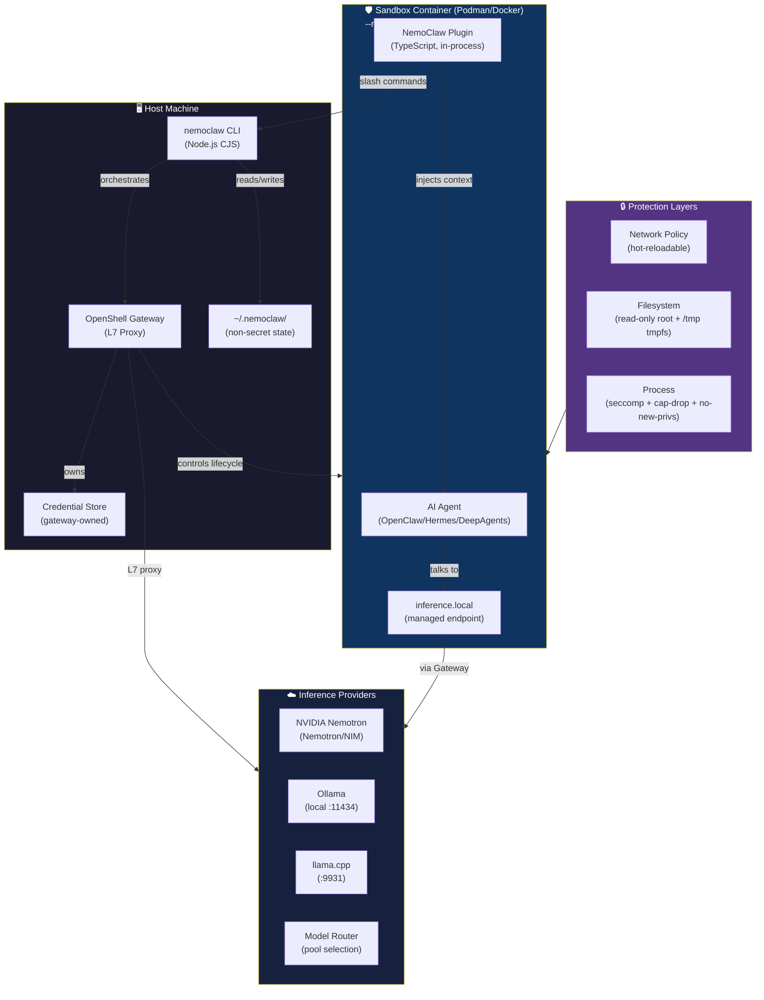
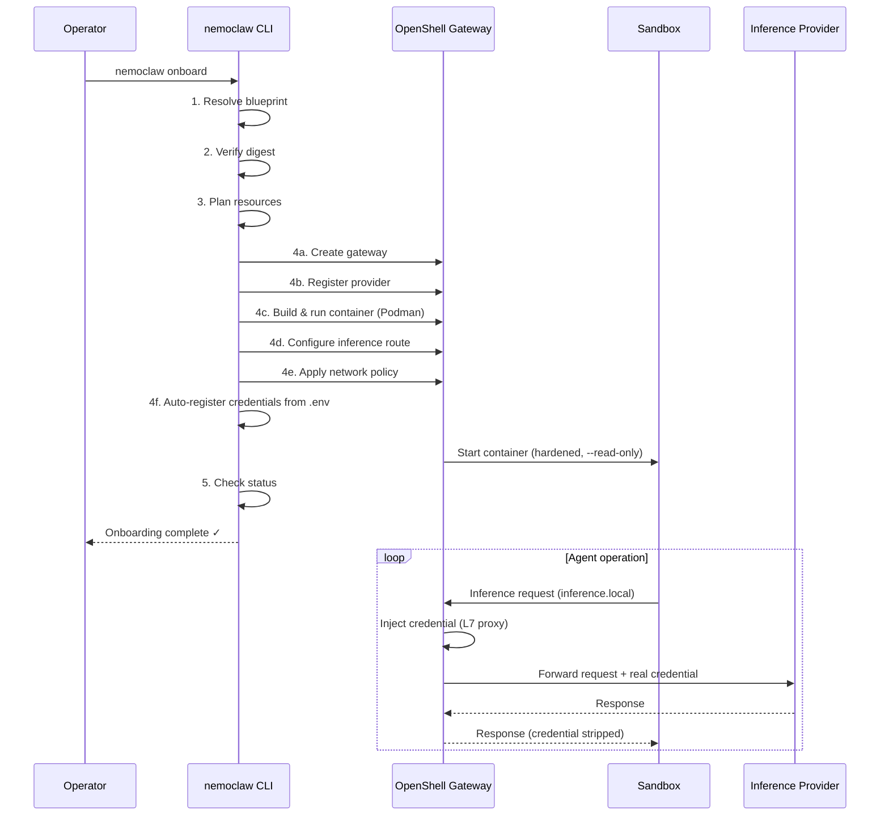

# NVIDIA NemoClaw: Reference Stack for Sandboxed AI Agents in OpenShell

[](LICENSE)
[](https://nodejs.org)
[](https://python.org)

NVIDIA NemoClaw is an open-source reference stack for running always-on AI agents more safely inside NVIDIA OpenShell sandboxes. It provides guided onboarding, a hardened blueprint, routed inference, network policy, and lifecycle management through a single CLI.

## Supported Agents

| Agent | Description |
|-------|-------------|
| **OpenClaw** (default) | Always-on AI assistant with managed inference |
| **Hermes** | Alternative agent runtime with NemoClaw integration |
| **LangChain Deep Agents Code** | Terminal-based code agent via `dcode` |

## Architecture



## Workflow



## Quick Start

```bash
# 1. Clone and configure
git clone https://github.com/NVIDIA/NemoClaw.git
cd NemoClaw
cp .env.example .env          # Fill in NVIDIA_API_KEY from build.nvidia.com

# 2. Install everything (deps + link CLI globally)
npm install && cd nemoclaw && npm install && npm run build && cd ..
npm link                      # makes 'nemoclaw' available as a global command

# Or use the one-shot setup script:
./scripts/dev-setup.sh

# 3. Set up Python environment
python3 -m venv venv && source venv/bin/activate
pip install -r requirements.txt

# 4. Verify host readiness
nemoclaw host probe

# 5. Onboard your first sandbox
#    (builds image, starts container, registers credentials automatically)
nemoclaw onboard

# 6. View live logs
nemoclaw logs --follow

# 7. Launch the Streamlit dashboard
./scripts/start.sh
# Open http://localhost:10001  (gateway port 10000 + 1)
```

> **Getting your NVIDIA API key**: Sign in at [build.nvidia.com](https://build.nvidia.com), open any model page, click **Get API Key → Generate Key**. Free tier gives 1,000 credits/month.

See [`Docs/Quickstart.md`](Docs/Quickstart.md) for detailed step-by-step instructions.

## Documentation

| Document | Description |
|----------|-------------|
| [Sandbox User Guide](Docs/NemoClaw-Sandbox-User-Guide.md) | Runnable sandbox demonstration, five test cases, and operations guide |
| [Quickstart](Docs/Quickstart.md) | Step-by-step setup guide |
| [Architecture](Docs/Architecture.md) | System architecture and component diagrams |
| [CLI Reference](Docs/CLI-Reference.md) | Full nemoclaw command reference |
| [Security](Docs/Security.md) | Security model, controls, and best practices |
| [User Stories](Docs/NemoClaw-User-Stories.md) | Feature specification and acceptance criteria |

## Project Structure

```
nemoclaw-test/
├── bin/                    # CLI entry point and library modules (CommonJS)
│   ├── nemoclaw.js         # Main CLI entry point
│   └── lib/                # onboard, inference, policies, runner, state,
│                           # credentials, sandbox, preflight, logger, completion
├── nemoclaw/               # TypeScript plugin (runs inside OpenClaw sandbox)
│   └── src/
│       ├── blueprint/      # Runner, SSRF validation, state, private networks
│       ├── commands/       # /nemoclaw slash command handlers
│       └── onboard/        # Onboarding configuration and validation
├── nemoclaw-blueprint/     # Blueprint YAML: sandbox image, policies, profiles
│   └── policies/
│       └── presets/        # Policy presets (slack, discord)
├── dashboard/              # Streamlit web UI (port 10001)
├── scripts/                # Bash automation
│   ├── start.sh            # Start Streamlit dashboard (detached)
│   ├── stop.sh             # Stop dashboard gracefully
│   ├── dev-setup.sh        # Full dev environment setup + npm link
│   ├── podman-build.sh     # Build sandbox container image
│   ├── podman-clean.sh     # Remove images/containers (--all/--prune/--full)
│   └── clean-dependencies.sh # Remove project-local node_modules and Python venvs
├── test/                   # Vitest (ESM) + pytest test suites
├── Docs/                   # Project documentation
├── k8s/                    # Kubernetes manifests
├── Containerfile           # Multi-stage optimized image (Podman-compatible)
├── Dockerfile              # Identical copy for Docker compatibility
└── .env.example            # Environment variable template
```

## Podman Image Management

```bash
# Build the sandbox image
./scripts/podman-build.sh

# Force full rebuild (no cache)
./scripts/podman-build.sh --no-cache

# Remove stopped containers + NemoClaw images
./scripts/podman-clean.sh

# Full reset (containers + images + volumes)
./scripts/podman-clean.sh --full

# Or via Makefile
make build-image
make clean-images-all
```

## Sandbox Demonstration

The repository includes an offline-friendly sandbox implementation that validates
NemoClaw-style enforcement without Podman, cloud inference, or API credentials.
The implementation is provided by [`scripts/nemoclaw_sandbox_demo.py`](scripts/nemoclaw_sandbox_demo.py)
and covers:

- private workspace filesystem access and traversal protection;
- agent capability allowlists;
- `inference.local` network allowlisting;
- memory, CPU, and wall-clock limits;
- communication between registered sandbox agents;
- structured policy failures and audit events; and
- deterministic sandbox teardown.

Run the demonstration and its five executable scenarios from the repository root:

```bash
python3 scripts/nemoclaw_sandbox_demo.py --json
python3 -m unittest discover -s test -p 'test_nemoclaw_sandbox.py' -v
```

| Scenario | Validation |
|----------|------------|
| Normal execution | Authorized workspace write/read succeeds |
| Boundary violation | Filesystem traversal and unapproved egress are denied |
| Resource enforcement | Excess memory and long-running work are stopped |
| Inter-agent communication | Registered agents exchange an in-sandbox message |
| Failure and teardown | Errors are structured and temporary state is removed |

The test implementation is in [`test/test_nemoclaw_sandbox.py`](test/test_nemoclaw_sandbox.py).
See the complete setup, configuration, results, troubleshooting, and production guidance in
[Docs/NemoClaw-Sandbox-User-Guide.md](Docs/NemoClaw-Sandbox-User-Guide.md).

## Remove Installed Project Dependencies

To remove this project's installed Node.js dependencies, Python virtual environments, and recursively generated `__pycache__/` folders:

```bash
# Preview the directories that would be removed
./scripts/clean-dependencies.sh --dry-run

# Confirm removal
./scripts/clean-dependencies.sh --yes

# Equivalent Make target
make clean-dependencies
```

The cleanup script removes only these project-local directories when present:

- `node_modules/`
- `nemoclaw/node_modules/`
- `.venv/`
- `venv/`
- every `__pycache__/` directory below the project root, including its compiled Python files

It does not remove global npm packages, system Python installations, source files, configuration files, or `.env`.

## Development

```bash
# Run all CLI tests (35 tests)
npm test

# Run TypeScript plugin tests (26 tests)
npm run test:plugin

# Run Python dashboard tests (14 tests)
source venv/bin/activate && pytest test/test_dashboard.py -v

# All 75 tests
make test-all

# Type-check CLI
npm run typecheck:cli

# Lint
npm run lint

# Build TypeScript plugin
cd nemoclaw && npm run build

# Re-link CLI after Node version switch
make link
```

## Security

- **No raw credentials in the sandbox** – the OpenShell L7 proxy injects credentials at egress; credentials are auto-registered from `.env` during `nemoclaw onboard`
- **Read-only container root filesystem** – `--read-only` flag; only `/tmp` and `~/.streamlit` are writable via `tmpfs`
- **Network egress controlled** – baseline policy blocks unauthorized connections; unapproved endpoints surface for operator approval
- **Process isolation** – `--cap-drop=all`, `--security-opt no-new-privileges`, seccomp + Landlock + network namespace
- **SSRF protection** – validates all egress endpoints against private/loopback ranges before allowing

**Reporting vulnerabilities**: Use [NVIDIA's private vulnerability disclosure](https://www.nvidia.com/en-us/security/report-vulnerability/). Do NOT open public issues.

## License

This project is licensed under the **Apache License 2.0**. See [LICENSE](LICENSE) for details.

## Contributing

See [CONTRIBUTING.md](CONTRIBUTING.md) for development setup, coding standards, and the PR process.
